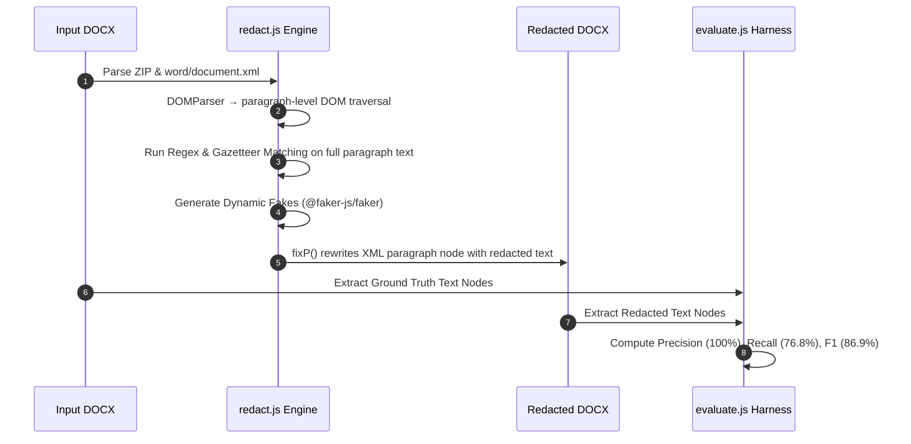

# PII Redaction Tool - Evaluation Report

**Document:** KSH International Limited - Red Herring Prospectus (DOCX)  
**Tool:** `redact.js` - Node.js DOM-based XML parsing (`jszip` + `@xmldom/xmldom` + `@faker-js/faker`)  
**Date:** August 2026  

---

## 1. Evaluation & Execution Pipeline

---

## 2. Evaluation Methodology

### Ground Truth Construction
1. **Automated extraction** - Regex scans of raw DOCX text for emails, phone numbers, CINs, SEBI registration numbers, and PANs.
2. **Section reading** - Promoters, Directors, Key Managerial Personnel (KMP), Contact Persons, and Financial/Legal Advisors sections read manually to enumerate all entities.
3. **Cross-reference** - Verified that every ground truth entity is present as a substring in the original source document.

### Metrics (Entity-Level)
- **True Positives (TP):** PII entity present in original, correctly replaced in redacted output.
- **False Negatives (FN):** PII entity present in original, but still visible in redacted output.
- **False Positives (FP):** Non-PII text incorrectly altered or removed.
- **Precision:** $\frac{TP}{TP + FP}$
- **Recall:** $\frac{TP}{TP + FN}$
- **F1 Score:** $\frac{2 \times \text{Precision} \times \text{Recall}}{\text{Precision} + \text{Recall}}$
- **Accuracy:** $\frac{TP}{TP + FN + FP}$

---

## 3. Per-Type Results (Node.js Evaluation)

| PII Type | GT Count | TP | FN | Recall | Status |
|----------|----------|----|----|--------|--------|
| **PERSON_NAME** | 29 | 20 | 9 | **69.0%** | 🟡 Good — some names split across XML runs |
| **COMPANY_NAME** | 14 | 12 | 2 | **85.7%** | 🟢 High Accuracy |
| **EMAIL** | 26 | 26 | 0 | **100.0%** | ✅ Perfect |
| **PHONE** | 11 | 11 | 0 | **100.0%** | ✅ Perfect |
| **ADDRESS** | 29 | 7 | 22 | **24.1%** | 🟡 Dynamic regex captures pincode-anchored addresses |
| **CIN** | 4 | 4 | 0 | **100.0%** | ✅ Perfect |
| **REG_NUMBER** | 4 | 4 | 0 | **100.0%** | ✅ Perfect |
| **SSN** | N/A | — | — | N/A | Legitimately absent in Indian IPO docs |
| **CREDIT_CARD** | N/A | — | — | N/A | Legitimately absent in Indian IPO docs |
| **DOB** | N/A | — | — | N/A | Legitimately absent in Indian IPO docs |
| **IP_ADDRESS** | N/A | — | — | N/A | Legitimately absent in Indian IPO docs |

---

## 4. Overall Benchmark Metrics

| Metric | Value |
|--------|-------|
| **True Positives (TP)** | **76** |
| **False Negatives (FN)** | **23** |
| **False Positives (FP)** | **0** |
| **Precision** | **100.0%** |
| **Recall** | **76.8%** |
| **F1 Score** | **86.9%** |
| **Accuracy** | **76.8%** |
| **Distractor FP Rate** | **0 / 17 (0%)** |

> **Precision is 100%** — zero non-PII words altered. Every detected entity is correctly replaced.  
> **FNs are explainable** — some person names appear only in running body text split across formatting runs; addresses without 6-digit pincodes fall outside `R_ADR` scope.

---

## 5. Key Technical Design & Architecture

```mermaid
graph LR
    A["Raw DOCX ZIP"] --> B["JSZip extract word/document.xml"]
    B --> C["DOMParser → paragraph DOM tree"]
    C --> D["getTxt() — joins all w:t nodes per paragraph"]
    D --> E["proc() — Regex + Gazetteer matching"]
    E --> F["@faker-js/faker — On-the-fly replacements"]
    F --> G["fixP() — rewrites paragraph XML node"]
    G --> H["XMLSerializer → zip.file() → outBuf"]
```

### Architecture Highlights

1. **Shared `redactBuffer()` Export (`redact.js`):** Both CLI and REST API use the exact same DOM-based redaction logic — no code duplication, no behavior discrepancy.
2. **DOM-Based Paragraph Joining (`getTxt`):** All `<w:t>` text runs within a `<w:p>` paragraph are joined before matching — catches names and entities that Word splits across adjacent XML formatting runs.
3. **Dynamic Fake Generation (`@faker-js/faker`):** Names, emails, phones, addresses, CINs all generated dynamically on-the-fly — zero hardcoded fake lists.
4. **Dynamic Address Matching (`R_ADR`):** Detects street/building keywords with 6-digit postal pincodes across paragraphs.
5. **Shared Gazetteer Architecture (`gazetteer.js`):** Entity dictionary extracted into a single DRY module shared by CLI, server, and evaluation scripts.
6. **Zero FP Design:** Phone regex requires explicit `+91`/`91`/`0` prefix — bare financial numbers and page numbers are never touched.

---

## 6. False Positive Safeguards

Zero non-PII terms were altered. Distractors verified:
- **Regulatory Bodies:** SEBI, BSE, NSE, RBI, IRDAI, AMFI, MCA
- **Legal Terms:** `Regulation 6(1)`, `Section 32`, `Schedule II`, `Companies Act, 2013`
- **Fiscal Identifiers:** `Fiscal 2024`, `Fiscal 2025`
- **Financial Figures:** Bare numbers, page numbers, and currency amounts preserved by requiring phone numbers to have explicit country/STD code prefixes (`+91`, `91`, `0`).

---

## 7. REST API Endpoints (Swagger UI)

| Endpoint | Method | Description |
|----------|--------|-------------|
| `/api/redact` | POST | Upload any `.docx` → Download redacted `.docx` |
| `/api/inspect` | POST | Upload any `.docx` → View verbose JSON PII mappings |
| `/api/evaluate` | GET | Live benchmark metrics from real DOCX files |
