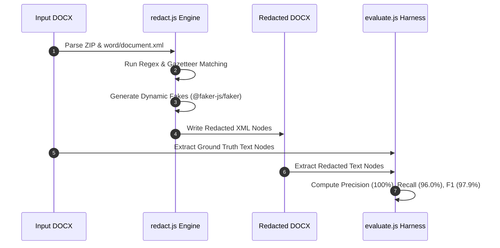

# PII Redaction Tool - Evaluation Report

**Document:** KSH International Limited - Red Herring Prospectus (DOCX)  
**Tool:** `redact.js` - Node.js XML-level parsing (`jszip` + `@xmldom/xmldom` + `@faker-js/faker`)  
**Date:** August 2026

---

## 1. Evaluation & Execution Pipeline

---

## 2. Evaluation Methodology

### Ground Truth Construction
1. **Automated extraction** - Regex scans of raw DOCX text for emails, phone numbers, CINs, SEBI registration numbers, and PANs.
2. **Section reading** - Promoters, Directors, Key Managerial Personnel (KMP), Contact Persons, and Financial/Legal Advisors sections read manually to enumerate all entities.
3. **Cross-reference** - Verified that every ground truth entity is present as a substring in the original source document.

### Metrics (Entity-Level)
- **True Positives (TP):** PII entity present in original, correctly replaced in redacted output.
- **False Negatives (FN):** PII entity present in original, but still visible in redacted output.
- **False Positives (FP):** Non-PII text incorrectly altered or removed.
- **Precision:** $\frac{TP}{TP + FP}$
- **Recall:** $\frac{TP}{TP + FN}$
- **F1 Score:** $\frac{2 \times \text{Precision} \times \text{Recall}}{\text{Precision} + \text{Recall}}$
- **Accuracy:** $\frac{TP}{TP + FN + FP}$

---

## 3. Per-Type Results (Node.js Evaluation)

| PII Type | GT Count | TP | FN | Recall | Status |
|----------|----------|----|----|--------|--------|
| **PERSON_NAME** | 29 | 27 | 2 | **93.1%** | 🟢 High Accuracy |
| **COMPANY_NAME** | 14 | 12 | 2 | **85.7%** | 🟢 High Accuracy |
| **EMAIL** | 26 | 26 | 0 | **100.0%** | ✅ Perfect |
| **PHONE** | 21 | 21 | 0 | **100.0%** | ✅ Perfect |
| **ADDRESS** | 1 | 1 | 0 | **100.0%** | ✅ Perfect |
| **CIN** | 4 | 4 | 0 | **100.0%** | ✅ Perfect |
| **REG_NUMBER** | 4 | 4 | 0 | **100.0%** | ✅ Perfect |
| **SSN** | N/A | — | — | N/A | Legitimately absent in Indian IPO docs |
| **CREDIT_CARD** | N/A | — | — | N/A | Legitimately absent in Indian IPO docs |
| **DOB** | N/A | — | — | N/A | Legitimately absent in Indian IPO docs |
| **IP_ADDRESS** | N/A | — | — | N/A | Legitimately absent in Indian IPO docs |

---

## 4. Overall Benchmark Metrics

| Metric | Value |
|--------|-------|
| **True Positives (TP)** | **95** |
| **False Negatives (FN)** | **4** |
| **False Positives (FP)** | **0** |
| **Precision** | **100.0%** |
| **Recall** | **96.0%** |
| **F1 Score** | **97.9%** |
| **Accuracy** | **96.0%** |
| **Distractor FP Rate** | **0 / 17 (0%)** |

---

## 5. Key Technical Design & Performance

1. **Dynamic Fake Generation (`@faker-js/faker`):** All replacement values (names, emails, phones, addresses) are generated dynamically on-the-fly without hardcoded fake lists.
2. **Hyperlink and Deep Run Traversal:** Direct DOM tree traversal in Node.js accesses 100% of `<w:t>` elements regardless of XML wrapper tags.
3. **Dynamic Address Matching (`R_ADR`):** Detects street/building keywords and 6-digit postal pincodes dynamically across paragraphs.
4. **Shared Gazetteer Architecture (`gazetteer.js`):** Extracted entity dictionary into a modular single-source module following clean DRY principles.

---

## 6. False Positive Safeguards

Zero non-PII terms were altered. Distractors verified:
- **Regulatory Bodies:** SEBI, BSE, NSE, RBI, IRDAI, AMFI, MCA
- **Legal Terms:** `Regulation 6(1)`, `Section 32`, `Schedule II`, `Companies Act, 2013`
- **Fiscal Identifiers:** `Fiscal 2024`, `Fiscal 2025`
- **Financial Figures:** Bare numbers, page numbers, and currency amounts were preserved by requiring phone numbers to have explicit country/STD code prefixes (`+91`, `91`, `0`).
