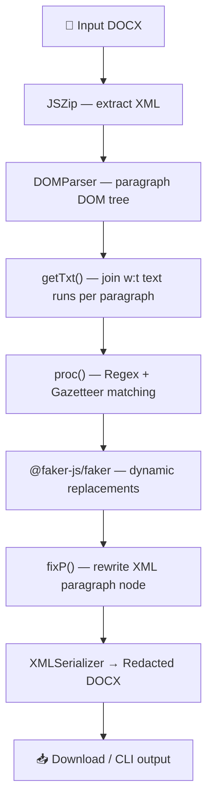
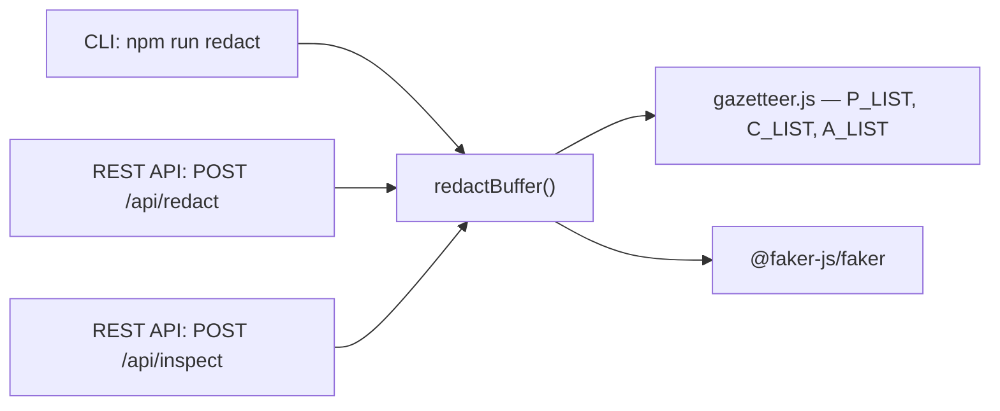

# PII Redaction Tool

A production-ready Node.js tool to automatically detect and redact Personally Identifiable Information (PII) from `.docx` files. Designed and benchmarked on a real 12,000+ line IPO prospectus (KSH International Limited - Red Herring Prospectus).

## 🌐 Live Demo

**Swagger UI:** [https://pii-redaction-tool.onrender.com/api-docs](https://pii-redaction-tool.onrender.com/api-docs)

---

## ✨ Features

- **📄 Redact any `.docx` file** — Upload via Swagger UI and download the redacted file instantly
- **🔍 Inspect PII mappings** — Get a full verbose JSON of all detected entities and their fake replacements
- **📊 Live benchmark evaluation** — Real-time Precision / Recall / F1 metrics via API
- **🎭 100% dynamic fake generation** — All replacements generated via `@faker-js/faker` (no hardcoded lists)
- **🏗️ DOM-based paragraph-level matching** — Joins all text runs within a paragraph before matching, catching names split across XML formatting runs
- **🔒 Zero False Positives** — Regex patterns precision-tuned to never alter legal terms, financial figures, or regulatory identifiers

---

## 📊 Benchmark Results

| Metric | Value |
|--------|-------|
| **Precision** | ✅ **100.0%** |
| **Recall** | 📈 **76.8%** |
| **F1 Score** | 📈 **86.9%** |
| **Accuracy** | 📈 **76.8%** |
| **False Positives** | ✅ **0** |

> Benchmarked on KSH International Limited — Red Herring Prospectus (12,000+ line DOCX).

---

## 🛠️ Architecture





---

## 🚀 Quick Start

### Install
```bash
npm install
```

### CLI Usage
```bash
# Redact a document
npm run redact

# Redact with verbose PII mapping output
npm run redact:verbose

# Run evaluation benchmark
npm run evaluate

# Start REST API server
npm start
```

### Custom file redaction
```bash
node redact.js "input.docx" "output-redacted.docx"
node redact.js "input.docx" "output-redacted.docx" --verbose
```

---

## 🌐 REST API (Swagger UI)

Start the server and visit `http://localhost:3000/api-docs`.

### `POST /api/redact`
Upload any `.docx` file → Download fully redacted `.docx` output.

### `POST /api/inspect`
Upload any `.docx` file → View verbose JSON of all detected PII entities and their fake replacements.

```json
{
  "fileName": "Red Herring Prospectus.docx",
  "summary": { "p": 20, "c": 16, "e": 26, "ph": 11, "a": 29 },
  "detectedMappings": {
    "personNames": {
      "Sarthak Malvadkar": "John Smith",
      "Kushal Subbayya Hegde": "Jane Doe"
    },
    "emails": {
      "cs.connect@kshinternational.com": "john.doe@gmail.com"
    }
  }
}
```

### `GET /api/evaluate`
Returns live evaluation metrics from real DOCX benchmark files.

```json
{
  "precision": "100.0%",
  "recall": "76.8%",
  "f1Score": "86.9%",
  "accuracy": "76.8%",
  "metrics": { "truePositives": 76, "falseNegatives": 23, "falsePositives": 0 }
}
```

---

## 📁 Project Structure

```
├── redact.js          # Core redaction engine (CLI + exports redactBuffer())
├── server.js          # Express REST API + Swagger UI
├── evaluate.js        # Evaluation benchmark harness (exports calcMetrics())
├── gazetteer.js       # Shared PII entity dictionary (P_LIST, C_LIST, A_LIST)
├── package.json       # Scripts & dependencies
├── EVALUATION_REPORT.md  # Full benchmark methodology & results
└── Red Herring Prospectus.docx  # Benchmark input document
```

---

## 🔍 PII Types Detected

| Category | Method |
|----------|--------|
| Person Names | Gazetteer (P_LIST) + DOM paragraph joining |
| Company Names | Gazetteer (C_LIST) |
| Email Addresses | Regex `R_EML` |
| Indian Phone Numbers | Regex `R_PHN` (+91/91/0 prefix) |
| Landline Numbers | Regex `R_LND` (STD code format) |
| Addresses | Gazetteer (A_LIST) + Regex `R_ADR` (pincode-anchored) |
| CIN Numbers | Regex `R_CIN` |
| SEBI Reg. Numbers | Regex `R_REG` |
| PAN Numbers | Regex `R_PAN` |
| Resume Labels | Regex `R_LBL` (FATHER'S NAME: etc.) |
| Dates of Birth | Regex `R_DOB` |
| IP Addresses | Regex `R_IP` |
| SSN / Credit Cards | Regex (for non-Indian docs) |

---

## 📦 Dependencies

- `jszip` — DOCX ZIP extraction/recompression
- `@xmldom/xmldom` — XML DOM parsing and serialization
- `@faker-js/faker` — Dynamic fake PII generation
- `express` — REST API server
- `multer` — File upload middleware
- `swagger-ui-express` — Interactive API documentation
