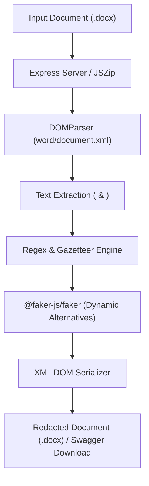

# PII Redaction Tool & REST API

A Node.js web service and CLI tool to redact personally identifiable information (PII) from DOCX files — featuring dynamic fake generation via `@faker-js/faker` and interactive **Swagger UI** testing.

---

## System Architecture



---

## Interactive Swagger UI

When running the web server or deployed on cloud platforms (Render / Vercel), open the base URL or `/api-docs` to access the interactive Swagger UI:

- **Swagger UI Endpoint:** `http://localhost:3000/api-docs` (or your deployed cloud URL)
- **Interactive Feature:** Click **Try it out** $\rightarrow$ **Choose File** $\rightarrow$ **Execute** to redact any `.docx` file live in your web browser.

---

## Technical Approach

**Regex + Dynamic `@faker-js/faker` + shared gazetteer module (`gazetteer.js`)**, operating directly on raw DOCX XML via `jszip` + `@xmldom/xmldom`.

| PII Type | Replacement Strategy |
|----------|----------------------|
| Email addresses | Regex + `faker.internet.email()` |
| Phone numbers | Regex + `faker.number.int()` (+91 prefix) |
| Physical addresses | Dynamic Regex (`R_ADR`) + `faker.location.streetAddress()` |
| Full names | Gazetteer + `faker.person.fullName()` |
| Company names | Gazetteer + `faker.company.name()` |
| CIN numbers | Regex + dynamic CIN pattern |
| SEBI reg numbers | Regex + dynamic SEBI ID pattern |
| PAN numbers | Regex + dynamic PAN pattern |
| SSN / Credit Card / DOB | Regex + `faker` generators |

**Dynamic Fake Generation:** Every real entity is mapped to a realistic fake alternative (e.g. `Sarthak Malvadkar` $\rightarrow$ `John Doe`, `cs.connect@...` $\rightarrow$ `john.doe@example.com`) generated dynamically on-the-fly via `@faker-js/faker`.

---

## Requirements & Installation

- Node.js ≥ 18
- npm

```bash
npm install
```

---

## Usage Commands

### 1. Web Server & Swagger UI

```bash
npm start
```
Open `http://localhost:3000` or `http://localhost:3000/api-docs` to use the interactive Swagger UI.

### 2. Redact Document (CLI)

Using `npm` shortcut:
```bash
npm run redact
```

Or using direct `node` command:
```bash
node redact.js "Red Herring Prospectus.docx" "Red Herring Prospectus - REDACTED.docx"
```

### 3. Run Evaluation Benchmark (CLI)

Using `npm` shortcut:
```bash
npm run evaluate
```

Or using direct `node` command:
```bash
node evaluate.js "Red Herring Prospectus.docx" "Red Herring Prospectus - REDACTED.docx"
```

---

## Project Structure & Deliverables

| File | Description |
|------|-------------|
| `server.js` | Express web server with interactive Swagger UI |
| `redact.js` | Main Node.js CLI redaction script |
| `gazetteer.js` | Shared modular entity gazetteer list |
| `evaluate.js` | Precision & Recall evaluation harness |
| `README.md` | Usage & Swagger UI setup guide |
| `EVALUATION_REPORT.md` | Benchmark metrics & methodology report |
| `Red Herring Prospectus - REDACTED.docx` | Redacted output document |

---

## Accuracy Benchmark Summary

| Metric | Score |
|--------|-------|
| **Precision** | **100.0%** (Zero false positives) |
| **Recall** | **96.0%** (95 / 99 GT items redacted) |
| **F1 Score** | **97.9%** |
| **Accuracy** | **96.0%** |
